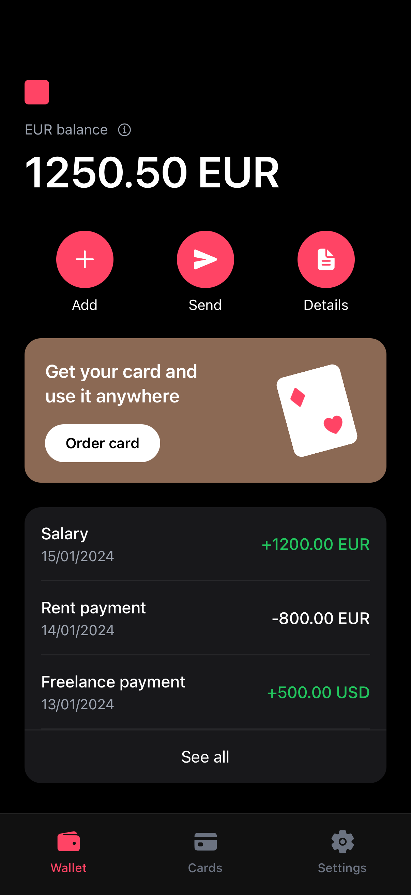
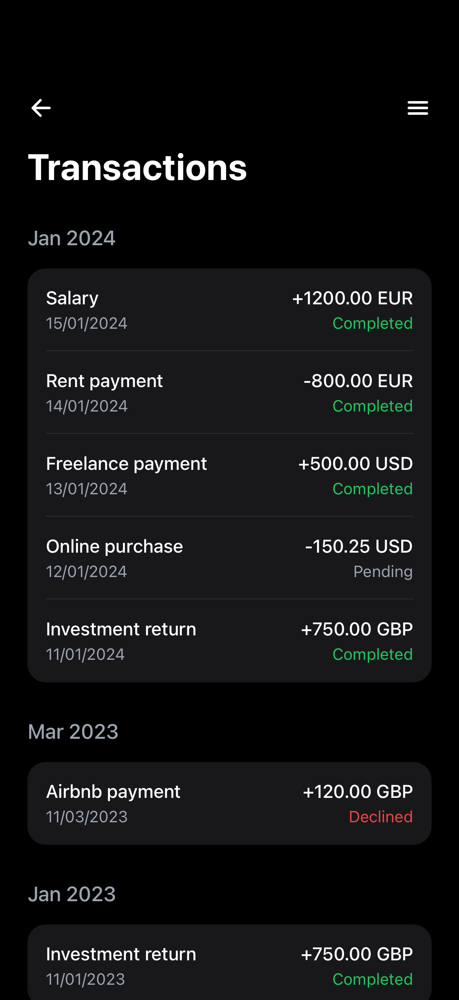
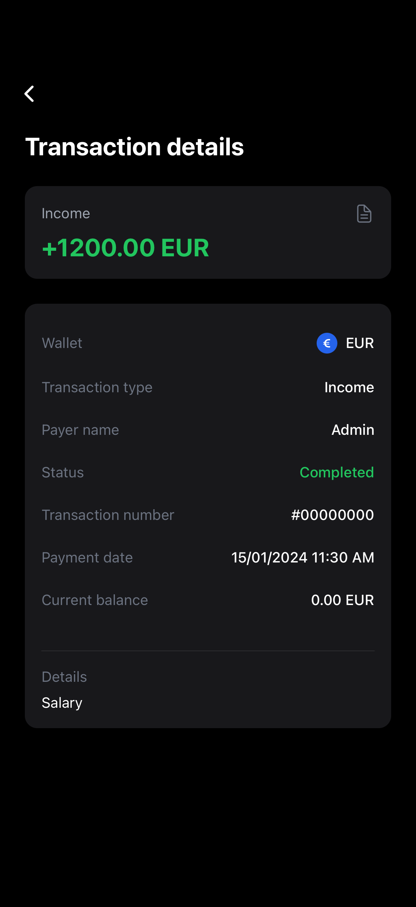

# 💰 Wallet App

A React Native mobile wallet application built with **Expo** that allows users to view wallet balances, transaction history, and manage payouts.

## Prerequisites

Before running this project, ensure you have:

- **Node.js** (v18 or higher)
- **npm** or **yarn**
- **Expo CLI** (optional, but recommended)
- **iOS Simulator** (macOS only) or **Android Emulator**
- **Expo Go** app on your physical device (alternative to emulators)

## Screenshots

| Home | Transactions | Transaction Details |
|:---:|:---:|:---:|
|  |  |  |

## Getting Started

### 1. Install Dependencies

Install the main app dependencies:

```bash
npm install
```

Install the mock server dependencies:

```bash
cd mock-server-main
npm install
cd ..
```

### 2. Start the Mock Server

The app requires a backend API to function. A mock server is provided for development:

```bash
cd mock-server-main
npm start
```

The server will start on **port 3000** by default. You should see:

```
Mock API server running on port 3000
Available endpoints:
  POST /auth/login - Login and get access token
  GET /balances - Get wallet balances
  GET /transactions - Get transactions with pagination
  POST /payouts - Initiate withdrawal/payout
  GET /health - Health check
```

> 💡 **Tip:** For development with auto-restart, use `npm run dev` instead.

### 3. Run the Mobile App

In a **new terminal window**, start the Expo development server:

```bash
npm start
```

Alternatively, run platform-specific commands:

```bash
# iOS (requires Xcode)
npm run ios

# Android (requires Android Studio)
npm run android

# Web
npm run web
```

## Running Tests

Run the test suite with:

```bash
npm test
```

Run tests in watch mode for development:

```bash
npm run test:watch
```

## Testing Error Handling

To see the error alert controller in action, you can simulate a network error by changing the API port number.

### How to Trigger the Error Alert:

1. Open `services/api.ts`
2. Change the `API_BASE_URL` port from `3000` to a different port (e.g., `3001`):

```typescript
// Change this:
const API_BASE_URL = 'http://localhost:3000';

// To this:
const API_BASE_URL = 'http://localhost:3001';
```

3. Save the file and reload the app
4. The app will fail to connect to the server, and you'll see an **error alert** with options to **Retry** or **Cancel**

This demonstrates the app's built-in error handling with the `showErrorAlert` function that provides user-friendly error messages for various scenarios:
- Network connection errors
- Request timeouts
- Server errors
- Authentication errors